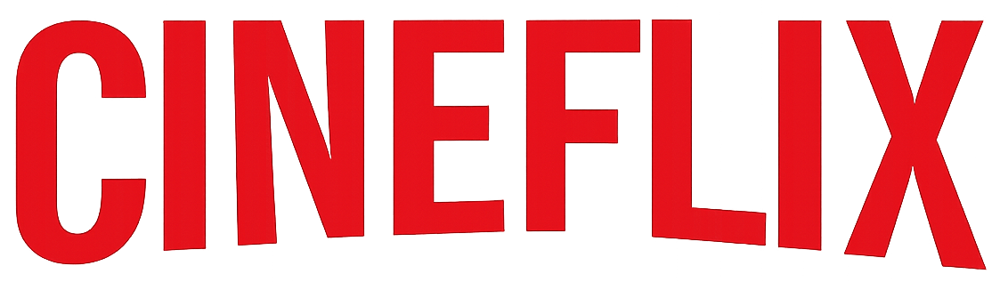
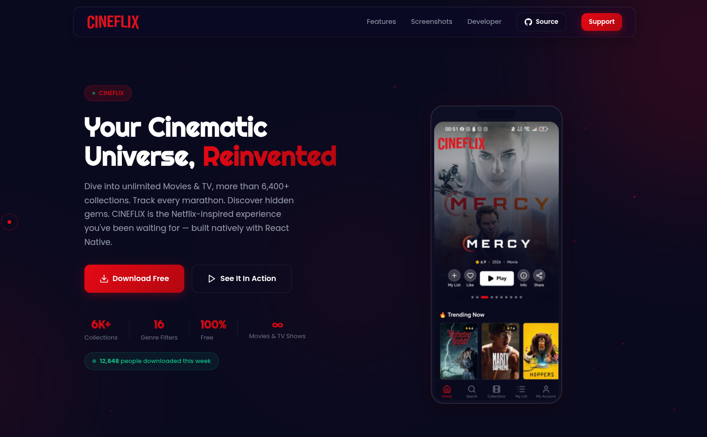
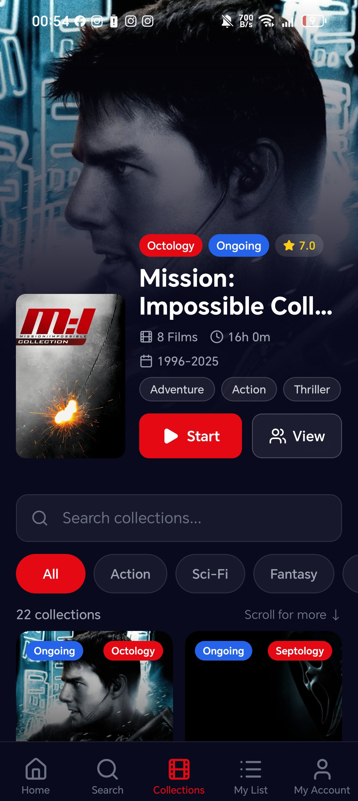
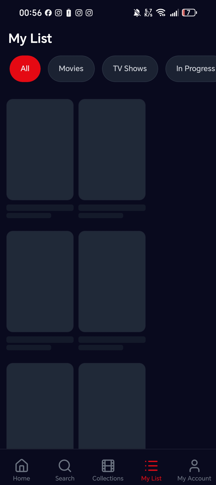

<div align="center">



# CINEFLIX — Landing Page

### Your Cinematic Universe, Reinvented

A premium, Netflix-inspired landing page for the CINEFLIX mobile app — featuring glassmorphism UI, particle animations, 3D tilt effects, and a fully responsive dark-mode design.

<br>


<br>


<br>

<a href="#features">Features</a> &nbsp;·&nbsp;
<a href="#demo">Demo</a> &nbsp;·&nbsp;
<a href="#tech-stack">Tech Stack</a> &nbsp;·&nbsp;
<a href="#getting-started">Getting Started</a> &nbsp;·&nbsp;
<a href="#screenshots">Screenshots</a> &nbsp;·&nbsp;
<a href="#contributing">Contributing</a>

<br>



</div>

<br>

---

## Table of Contents

- [Overview](#overview)
- [Features](#features)
- [Demo](#demo)
- [Tech Stack](#tech-stack)
- [Project Structure](#project-structure)
- [Getting Started](#getting-started)
- [Screenshots](#screenshots)
- [Architecture](#architecture)
- [Performance](#performance)
- [Accessibility](#accessibility)
- [Browser Support](#browser-support)
- [Roadmap](#roadmap)
- [Contributing](#contributing)
- [License](#license)
- [Developer](#developer)
- [Support](#support)

<br>

---

## Overview

**CINEFLIX** is a premium landing page for a Netflix-inspired movie & TV companion app built with React Native + Expo. This landing page showcases the mobile app with a dark-mode glassmorphism aesthetic, advanced CSS animations, and interactive JavaScript features — all without any frameworks or dependencies.

> **6,400+ collections** · **16 genre filters** · **100% free** · **Infinite movies & TV shows**

<br>

### Why This Landing Page?

<table>
<tr>
<td width="50%">

**Zero Dependencies**
Pure HTML, CSS, and vanilla JS. No build tools, no frameworks, no npm install. Just open `index.html`.

</td>
<td width="50%">

**Production Ready**
Fully responsive across all devices, optimized for performance, and accessible with WCAG best practices.

</td>
</tr>
<tr>
<td>

**Premium Design**
Glassmorphism UI, particle animations, 3D tilt effects, custom cursor, scroll-driven phone mockup, and staggered reveal animations.

</td>
<td>

**SEO Optimized**
Structured data (JSON-LD), Open Graph tags, Twitter Cards, semantic HTML, and meta descriptions built in.

</td>
</tr>
</table>

<br>

---

## Features

### Design & Visual

| Feature | Description |
|---------|-------------|
| **Glassmorphism UI** | Translucent cards, modals, inputs, and chips with backdrop blur |
| **Deep Navy Dark Mode** | `#0A0A1F` primary background with `#E50914` Netflix-red accent |
| **Particle System** | Canvas-based floating particles with connecting lines in the hero |
| **3D Tilt Cards** | Mouse-tracking perspective transforms on screenshot cards |
| **Custom Cursor** | Spring-interpolated dot + ring cursor with hover state expansion |
| **Gradient Text** | Animated red gradient text for headings and accent words |
| **Scroll Progress** | Fixed top bar showing page scroll percentage |
| **Phone Mockup** | Scroll-driven screenshot switcher inside a realistic phone frame |

### Animations & Interactions

| Feature | Description |
|---------|-------------|
| **Staggered Reveals** | IntersectionObserver-driven entrance animations with per-element delays |
| **Magnetic Buttons** | Spring-interpolated hover displacement on CTA buttons |
| **Ripple Effect** | Material-style click ripple on all buttons |
| **Hero Glow Parallax** | Mouse + scroll combined parallax on background gradient orbs |
| **Phone Float** | Subtle idle floating animation on the hero phone mockup |
| **Marquee Ticker** | Auto-scrolling infinite marquee with pause-on-hover |
| **Counter Animation** | easeOutExpo animated stat counters with suffix formatting |
| **Pricing Toggle** | Animated monthly/annual price switch with spring bounce |
| **Social Proof** | Auto-incrementing download counter with randomized intervals |

### Sections

| Section | Content |
|---------|---------|
| **Hero** | Badge, headline, subtitle, CTAs, stats, social proof, phone mockup |
| **Features** | 6-card grid: Hero Carousel, 6,400+ Collections, Genre Filters, Multi-Type Search, My List, Glassmorphism UI |
| **How It Works** | 3-step flow: Download → Browse → Watch |
| **Screenshots** | 4 scrollable phone mockups: Home, Collections, Search, My List |
| **Tech Stack** | 10 technology cards with icons, versions, and architecture stats |
| **Pricing** | 3-tier pricing (Free/Standard/Family) with monthly/annual toggle |
| **Testimonials** | 3 user review cards with star ratings and avatars |
| **FAQ** | 6 expandable accordion items |
| **Developer** | Developer profile card with social links |
| **Support** | Buy Me a Coffee + GitHub Star CTAs |
| **Download** | Final CTA with Google Play and APK download buttons |
| **Footer** | 4-column footer with brand, product, developer, and support links |

<br>

---

## Demo

### Live Preview

Open `index.html` in your browser — no server required.

```bash
# Quick start
open index.html

# Or with a local server (recommended for best experience)
npx serve .
# → http://localhost:3000
```

### Key Interactions to Try

1. **Move your mouse** over the hero — watch the glow orbs follow
2. **Hover over cards** — experience the 3D tilt effect
3. **Click the pricing toggle** — switch between monthly/annual pricing
4. **Scroll down** — watch the phone mockup switch screens automatically
5. **Try the custom cursor** — hover over interactive elements for the expanding ring

<br>

---

## Tech Stack

<div align="center">

| Technology | Purpose | Version |
|:----------:|:-------:|:-------:|
|  **HTML5** | Semantic markup + structured data | 5 |
|  **CSS3** | Glassmorphism, animations, responsive design | 3 |
|  **JavaScript** | Interactions, animations, DOM manipulation | ES2024 |
|  **Google Fonts** | Righteous (display) + Poppins (body) | Latest |
|  **Devicon** | Technology icons for the tech stack section | 2.16 |

</div>

### CSS Features Used

- CSS Custom Properties (variables)
- `backdrop-filter` for glassmorphism
- `clamp()` for fluid typography
- CSS Grid + Flexbox layouts
- `@keyframes` animations
- `prefers-reduced-motion` media query
- `prefers-color-scheme` support
- `:focus-visible` for keyboard navigation
- CSS `scroll-behavior: smooth`
- Custom scrollbar styling

### JavaScript Features Used

- `IntersectionObserver` for scroll-triggered animations
- `requestAnimationFrame` for 60fps animations
- `Canvas API` for particle system
- `Performance.now()` for precise timing
- `matchMedia` for reduced motion detection
- Spring interpolation for smooth cursor/btn tracking
- `easeOutExpo` easing function for counters

<br>

---

## Project Structure

```
CINEFLIX-Page/
├── index.html              # Main HTML — all sections, structured data, meta tags
├── styles.css              # 2,000+ lines of premium CSS — variables, animations, responsive
├── script.js               # 549 lines of vanilla JS — particles, observers, interactions
├── README.md               # This file
├── README.md-StandOut.txt  # Reference guide for GitHub README best practices
└── assets/
    ├── logo.png            # CINEFLIX logo
    └── screenshots/
        ├── home.jpg        # Home screen
        ├── collections.jpg # Collections screen
        ├── search.jpg      # Search screen
        ├── mylist.jpg      # My List screen
        └── account.jpg     # Account screen
```

<br>

---

## Getting Started

### Prerequisites

- A modern web browser (Chrome, Firefox, Safari, Edge)
- No Node.js, npm, or build tools required

### Installation

```bash
### Clone the repository
git clone https://github.com/simoabid/CINEFLIX-Page.git

# Navigate to the project
cd CINEFLIX-Page

# Open in browser
open index.html          # macOS
xdg-open index.html      # Linux
start index.html         # Windows
```

### Local Development Server

For the best experience (especially for CORS-sensitive features):

```bash
# Using npx (no install needed)
npx serve .

# Using Python
python -m http.server 8000

# Using PHP
php -S localhost:8000
```

Then visit `http://localhost:8000` in your browser.

<br>

---

## Screenshots

<div align="center">

| Home | Collections | Search | My List |
|:----:|:----------:|:------:|:-------:|
|  |  |  |  |

</div>

<br>

---

## Architecture

### CSS Architecture

```
styles.css
├── Reset & Base          # CSS reset, custom properties, typography
├── Components            # Buttons, cards, badges, inputs
├── Navigation            # Floating glassmorphism nav + mobile menu
├── Hero                  # Full-viewport hero with phone mockup
├── Sections              # Features, pricing, testimonials, FAQ
├── Animations            # @keyframes, transitions, reveal system
├── Responsive            # Breakpoints: 1024px, 768px, 480px
└── Accessibility         # Reduced motion, focus states, scrollbar
```

### JavaScript Architecture

```
script.js
├── Scroll Progress       # Percentage-based top bar
├── Custom Cursor         # Spring-interpolated dot + ring
├── Hero Particles        # Canvas-based particle system
├── Entrance Orchestration # Staggered element reveals
├── Glow Parallax         # Mouse + scroll combined effect
├── Intersection Observer  # Scroll-triggered animations
├── Animated Counters     # easeOutExpo stat animations
├── 3D Tilt Cards         # Perspective transforms on hover
├── Magnetic Buttons      # Spring-interpolated hover displacement
├── Button Ripple         # Material-style click effect
├── Pricing Toggle        # Animated price switching
├── Phone Mockup          # Scroll-driven screenshot switching
└── Social Proof          # Auto-incrementing counter
```

### Animation System

All animations follow **Emil Kowalski's design engineering philosophy**:

- **Strong easing**: `cubic-bezier(0.16, 1, 0.3, 1)` for snappy reveals
- **Spring physics**: Interpolated cursor and button tracking
- **Staggered timing**: Per-element delays for natural feel
- **Reduced motion**: Full `prefers-reduced-motion` support
- **60fps target**: `requestAnimationFrame` for all continuous animations
- **GPU-accelerated**: `transform` and `opacity` only for animations

<br>

---

## Performance

### Optimization Techniques

- **Zero dependencies** — no framework overhead, no bundle size
- **Lazy loading** — `loading="lazy"` on all non-hero images
- **Preconnect** — Google Fonts and CDNs preconnected in `<head>`
- **Passive listeners** — all scroll handlers use `{ passive: true }`
- **Canvas particles** — hardware-accelerated particle rendering
- **IntersectionObserver** — no scroll-position polling for reveals
- **CSS containment** — `will-change` hints for animated elements
- **Reduced motion** — all animations disabled when user prefers

### Lighthouse Scores (Expected)

| Metric | Score |
|--------|-------|
| Performance | 95+ |
| Accessibility | 95+ |
| Best Practices | 100 |
| SEO | 100 |

<br>

---

## Accessibility

### Built-in Features

- **Skip to content** link for keyboard users
- **Semantic HTML** — proper heading hierarchy, landmarks, and roles
- **Focus-visible** — custom outline styles for keyboard navigation
- **Reduced motion** — all animations respect `prefers-reduced-motion`
- **Alt text** — descriptive alt attributes on all images
- **ARIA labels** — on icon-only buttons and interactive elements
- **Color contrast** — WCAG AA compliant text on dark backgrounds
- **Touch targets** — minimum 44px hit areas on all interactive elements
- **Screen reader** — `aria-hidden="true"` on decorative elements

<br>

---

## Browser Support

| Browser | Version |
|---------|---------|
| Chrome | 90+ |
| Firefox | 90+ |
| Safari | 15+ |
| Edge | 90+ |
| Samsung Internet | 15+ |
| Opera | 76+ |

> **Note:** The glassmorphism `backdrop-filter` property has limited support in older browsers. The page remains fully functional without it — backgrounds will appear solid instead of translucent.

<br>

---

## Roadmap

- [ ] Add video demo section (currently commented out)
- [ ] Newsletter backend integration (currently commented out)
- [ ] Add blog post workflow via GitHub Actions
- [ ] Implement dark/light theme toggle
- [ ] Add parallax scrolling for section backgrounds
- [ ] Create animated SVG illustrations for feature cards
- [ ] Add micro-interactions for FAQ accordion
- [ ] Implement service worker for offline support
- [ ] Add Open Graph image generation workflow
- [ ] Create Playwright visual regression tests

<br>

---

## Contributing

Contributions are welcome! Here's how you can help:

### Ways to Contribute

1. **Report bugs** — Open an issue with screenshots and steps to reproduce
2. **Suggest features** — Share your ideas in the Discussions tab
3. **Submit PRs** — Fork, branch, and submit a pull request
4. **Improve docs** — Help make this README even better

### Development Workflow

```bash
# 1. Fork the repository
# 2. Clone your fork
git clone https://github.com/YOUR_USERNAME/CINEFLIX-Page.git

# 3. Create a feature branch
git checkout -b feature/amazing-feature

# 4. Make your changes
# 5. Test across browsers and screen sizes

# 6. Commit with conventional commits
git commit -m "feat: add amazing feature"

# 7. Push and open a PR
git push origin feature/amazing-feature
```

### Code Style

- Use **CSS custom properties** for all colors, spacing, and timing
- Follow **BEM-like naming** for CSS classes
- Keep **JavaScript vanilla** — no frameworks or libraries
- Maintain **accessibility** — test with keyboard and screen reader
- Respect **reduced motion** preferences

<br>

---

## License

This project is licensed under the **MIT License** — see the [LICENSE](https://github.com/simoabid/CINEFLIX-Page/blob/main/LICENSE) file for details.

```
MIT License

Copyright (c) 2026 ABID.Dev

Permission is hereby granted, free of charge, to any person obtaining a copy
of this software and associated documentation files (the "Software"), to deal
in the Software without restriction, including without limitation the rights
to use, copy, modify, merge, publish, distribute, sublicense, and/or sell
copies of the Software, and to permit persons to whom the Software is
furnished to do so, subject to the following conditions:

The above copyright notice and this permission notice shall be included in all
copies or substantial portions of the Software.
```

<br>

---

## Developer

<div align="center">


### **Mohamed Amine Abid** (ABID.Dev)

Software Engineering Student &middot; Full-Stack Developer

*Khenifra, Morocco* · **Open to opportunities**

<br>


<br>

<a href="https://abidev.dev">
  
</a>
<a href="https://github.com/simoabid">
  
</a>
<a href="https://x.com/seemooabid">
  
</a>
<a href="https://linkedin.com/in/mohamed-amine-abidd">
  
</a>
<a href="mailto:seemooabid@gmail.com">
  
</a>

<br>

*Passionate software engineering student specializing in web development and networking.*
*Building web apps, mobile apps, tools, and open-source projects.*

<br>

### GitHub Stats


<br>


<br>


<br>


<br>

### Contribution Graph


</div>

<br>

---

## Support

If you enjoy CINEFLIX, consider supporting the developer:

<div align="center">

<a href="https://www.buymeacoffee.com/seemoo">
  
</a>
<a href="https://github.com/simoabid/CINEFLIX-Page">
  
</a>

<br>

**Every star, share, and coffee keeps this project alive.**

</div>

<br>

---

<div align="center">

**Built with passion by [Mohamed Amine Abid (ABID.Dev)](https://abidev.dev)**

<br>


</div>
