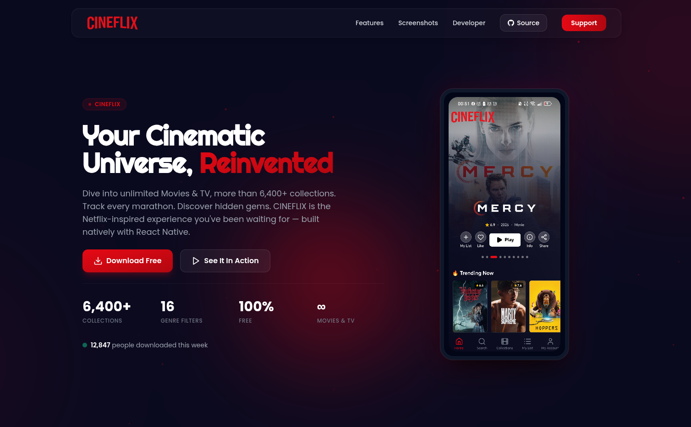
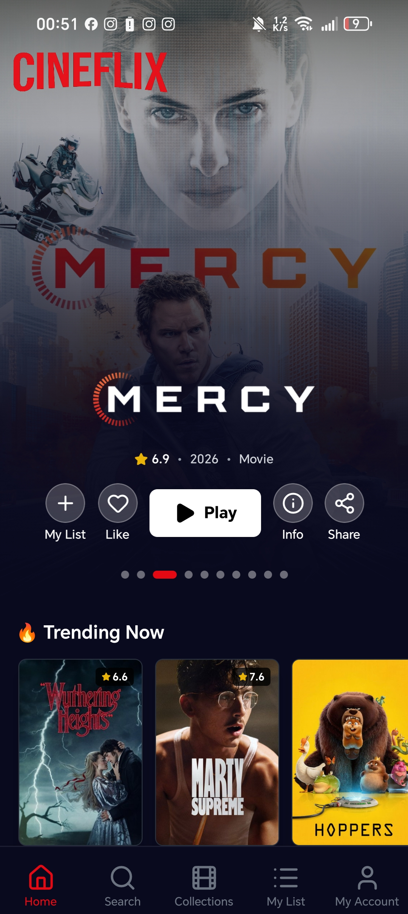
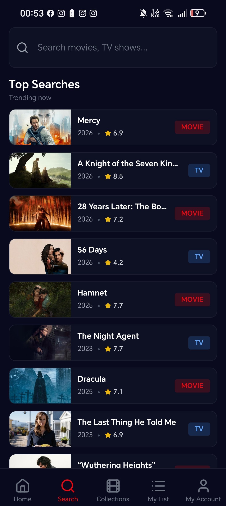

<div align="center">


# CINEFLIX — Landing Page

### Your Cinematic Universe, Reinvented

A premium, Netflix-inspired landing page for the CINEFLIX mobile app — rebuilt with a modern frontend stack featuring React, Vite, Tailwind CSS, TypeScript, and Vitest.

<br>


<br>


<br>

<a href="#features">Features</a> &nbsp;·&nbsp;
<a href="#demo">Demo</a> &nbsp;·&nbsp;
<a href="#tech-stack">Tech Stack</a> &nbsp;·&nbsp;
<a href="#getting-started">Getting Started</a> &nbsp;·&nbsp;
<a href="#screenshots">Screenshots</a> &nbsp;·&nbsp;
<a href="#contributing">Contributing</a>

<br>



</div>

<br>

---

## Table of Contents

- [Overview](#overview)
- [Features](#features)
- [Demo](#demo)
- [Tech Stack](#tech-stack)
- [Project Structure](#project-structure)
- [Getting Started](#getting-started)
- [Screenshots](#screenshots)
- [Architecture](#architecture)
- [Performance](#performance)
- [Accessibility](#accessibility)
- [Browser Support](#browser-support)
- [Roadmap](#roadmap)
- [Contributing](#contributing)
- [License](#license)
- [Developer](#developer)
- [Support](#support)

<br>

---

## Overview

**CINEFLIX** is a premium landing page for a Netflix-inspired movie & TV companion app. This landing page has been migrated from a legacy single-file setup into a modern, production-ready frontend project using **React 18, Vite, TypeScript, and Tailwind CSS**. It showcases the mobile app's screens using a floating liquid-glass theme, canvas animations, and a client-side search simulation grid, backed by a comprehensive Vitest test suite.

> **6,400+ collections** · **16 genre filters** · **100% free** · **Infinite movies & TV shows**

<br>

### Why This Landing Page?

<table>
<tr>
<td width="50%">

**Modern Tooling**
Fast compilation and bundling with Vite, strict type safety with TypeScript, and easy utility-first styles with Tailwind CSS.

</td>
<td width="50%">

**Production Ready**
Fully responsive layouts, optimized asset delivery, clear SEO structures, and automated tests.

</td>
</tr>
<tr>
<td>

**Premium Design**
Floating glass header, interactive mouse glow parallax, spring-interpolated custom cursor, and canvas-based hero particle fields.

</td>
<td>

**Automated Testing**
Includes 20 passing unit and integration tests verifying all interactive user flows.

</td>
</tr>
</table>

<br>

---

## Features

### Design & Visual

| Feature | Description |
|---------|-------------|
| **Floating Liquid Glass** | Translucent inner nav container with backdrop blur, transitioning its borders and opacity dynamically on scroll. |
| **Deep Navy Dark Mode** | `#0A0A1F` primary dark background with `#E50914` Netflix-red accent. |
| **Particle System** | Canvas-based connecting particle lines in the hero with viewport resize hooks. |
| **Glass Mockup Frames** | Screen mockup layouts utilizing glass glares and diagonal hover sweep animations. |
| **Custom Cursor** | Spring-interpolated dot + ring mouse tracker with interactive hover expansions. |
| **Gradient Text** | Smooth animated red gradient headers and branding elements. |

### Animations & Interactions

| Feature | Description |
|---------|-------------|
| **Dynamic Mockup Switcher** | Hero mockup frame that updates active screenshot slides as you scroll sections or click controls. |
| **Movie Search & Filter Simulator** | Client-side movie grid populated with mock data, enabling immediate search query updates and genre filters. |
| **Pricing Switcher** | Toggles monthly vs annual pricing models with custom bounce transitions. |
| **Accessible Accordion** | FAQ panels built with proper WAI-ARIA states, transitions, and keyboard controls. |

---

## Demo

### Local Setup
Run a local Vite server to preview the landing page:
```bash
# Start development server
npm run dev
# → http://localhost:5173
```

### Key Interactions to Try
1. **Explore the search grid** — type a query or click on genre buttons (e.g., "Sci-Fi").
2. **Click the pricing switch** — see prices and discount tags change instantly.
3. **Scroll the page** — watch the phone mockup swap screens as you hit sections.
4. **Hover mockups and buttons** — feel the spring custom cursor react and watch diagonal shines sweep the screens.

<br>

---

## Tech Stack

<div align="center">

| Technology | Purpose | Version |
|:----------:|:-------:|:-------:|
|  **React** | Component-driven UI development | 18.2 |
|  **Vite** | Bundling and fast local development dev server | 4.4 |
|  **TypeScript** | Strict compile-time type safety | 5.0 |
|  **Tailwind CSS** | Custom styling, glassmorphism, and responsive utilities | 3.3 |
|  **Google Fonts** | Righteous (headers) + Poppins (body text) | Latest |
|  **Vitest** | Fast component testing using jsdom environment | 4.1 |

</div>

<br>

---

## Project Structure

```
CINEFLIX-Page/
├── dist/                   # Bundled production static build output
├── public/                 # Static assets (logo, screen images)
├── src/
│   ├── __tests__/          # Global test configuration and setup mocks
│   ├── components/         # Modular React components
│   │   ├── __tests__/      # Component-level unit and integration test suites
│   │   ├── Accordion.tsx   # FAQ panels
│   │   ├── Cursor.tsx      # Spring mouse follower
│   │   ├── HeroParticles.tsx # Canvas interactive particles
│   │   ├── MockupSwitcher.tsx # Phone frame slide switcher
│   │   ├── MovieSearch.tsx # Interactive client-side search grid
│   │   └── Pricing.tsx     # billing toggle switch
│   ├── contexts/           # Global state contexts (MockupContext)
│   ├── types/              # Type definitions (Movie structures)
│   ├── App.tsx             # Main layout and section assemblies
│   ├── index.css           # Global custom scrollbars and base CSS properties
│   └── main.tsx            # Vite/React entry point
├── package.json            # Scripts, dependencies, and dev dependencies
├── tailwind.config.js      # Custom theme setup, animations, keyframes
├── vite.config.ts          # Vite configurations
└── vitest.config.ts        # Vitest configurations for JSDOM
```

<br>

---

## Getting Started

### Prerequisites
- Node.js (v18 or higher recommended)
- npm package manager

### Installation

1. **Clone the repository:**
   ```bash
   git clone https://github.com/simoabid/CINEFLIX-Page.git
   cd CINEFLIX-Page
   ```

2. **Install dependencies:**
   ```bash
   npm install
   ```

3. **Start local development server:**
   ```bash
   npm run dev
   ```

4. **Run automated Vitest test suite:**
   ```bash
   npm run test
   ```

5. **Build production bundle:**
   ```bash
   npm run build
   ```

<br>

---

## Screenshots

<div align="center">

| Home | Collections | Search | My List |
|:----:|:----------:|:------:|:-------:|
|  |  |  |  |

</div>

<br>

---

## Architecture

### Component Design
- **Single Level of Abstraction:** Components are broken down into self-contained files.
- **Controlled Context:** Context providers manage shared state (like which section is active for the device mockup) so components are loosely coupled.

### Testing Strategy
Built using JSDOM environment in Vitest to verify rendering behaviors:
- **Pricing:** Verifies displayed currency and annual billing switches.
- **Search Grid:** Validates search string inputs and genre button filters.
- **Accordion:** Ensures proper WAI-ARIA values change on clicks.

---

## Performance

- **Code Splitting & Bundling:** Handled by Vite and Esbuild for optimized bundle size.
- **Asset Delivery:** Public directory holds optimized images. Non-hero images leverage lazy loading attributes.
- **Hardware Acceleration:** Animations prioritize `transform` and `opacity` to keep renderings running at a smooth 60fps.

<br>

---

## Accessibility

- **Semantic HTML:** Utilizes appropriate document landmarks (`<header>`, `<main>`, `<section>`, `<footer>`).
- **Keyboard Access:** Interactive elements support tab focus and outline highlights. The FAQ accordion listens to keyboard triggers.
- **ARIA States:** Accordions track `aria-expanded` and `aria-controls` to match modern accessibility guidelines.

<br>

---

## Roadmap

- [ ] Add video demo section
- [ ] Newsletter backend integration
- [ ] Add blog post workflow via GitHub Actions
- [ ] Implement service worker for offline support
- [ ] Add Open Graph image generation workflow

<br>

---

## Contributing

Contributions are welcome! Please follow these guidelines:

1. Fork the repository and create your feature branch: `git checkout -b feature/amazing-feature`.
2. Commit your changes using conventional commits: `git commit -m "feat: add amazing feature"`.
3. Verify that all compiler checks and test runs pass cleanly before opening a PR:
   ```bash
   npm run test
   npm run build
   ```

<br>

---

## License

This project is licensed under the **MIT License** — see the `LICENSE` file for details.

```
MIT License

Copyright (c) 2026 ABID.Dev

Permission is hereby granted, free of charge, to any person obtaining a copy
of this software and associated documentation files (the "Software"), to deal
in the Software without restriction, including without limitation the rights
to use, copy, modify, merge, publish, distribute, sublicense, and/or sell
copies of the Software, and to permit persons to whom the Software is
furnished to do so, subject to the following conditions:

The above copyright notice and this permission notice shall be included in all
copies or substantial portions of the Software.
```

<br>

---

## Developer

<div align="center">


### **Mohamed Amine Abid** (ABID.Dev)

Software Engineering Student &middot; Full-Stack Developer

*Khenifra, Morocco* · **Open to opportunities**

<br>


<br>

<a href="https://abidev.dev">
  
</a>
<a href="https://github.com/simoabid">
  
</a>
<a href="https://x.com/seemooabid">
  
</a>
<a href="https://linkedin.com/in/mohamed-amine-abidd">
  
</a>
<a href="mailto:seemooabid@gmail.com">
  
</a>

<br>

*Passionate software engineering student specializing in web development and networking.*
*Building web apps, mobile apps, tools, and open-source projects.*

<br>

### GitHub Stats


<br>


<br>


<br>


<br>

### Contribution Graph


</div>

<br>

---

## Support

If you enjoy CINEFLIX, consider supporting the developer:

<div align="center">

<a href="https://www.buymeacoffee.com/seemoo">
  
</a>
<a href="https://github.com/simoabid/CINEFLIX-Page">
  
</a>

<br>

**Every star, share, and coffee keeps this project alive.**

</div>

<br>

---

<div align="center">

**Built with passion by [Mohamed Amine Abid (ABID.Dev)](https://abidev.dev)**

<br>


</div>
